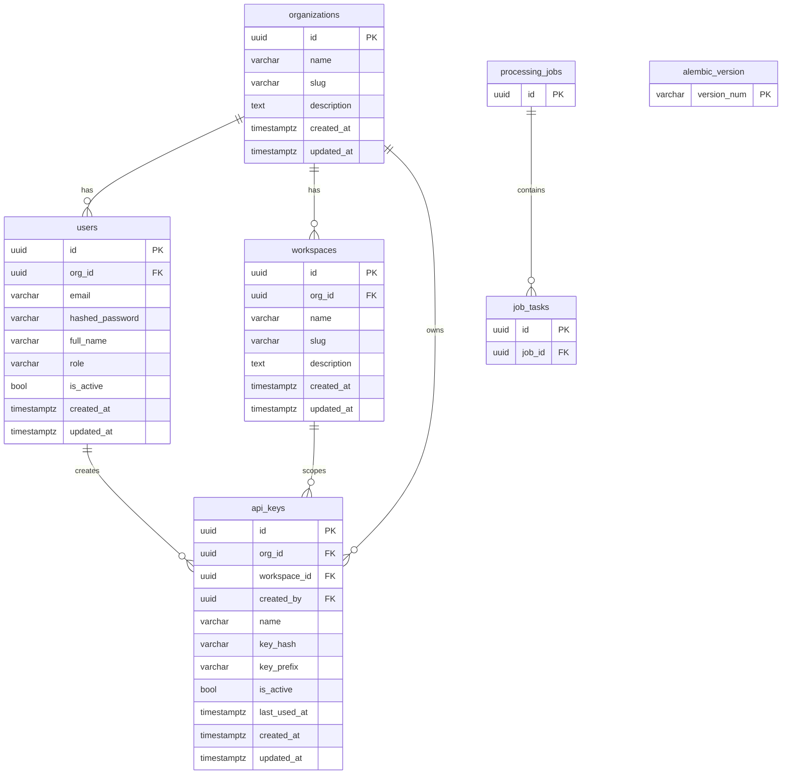

# RAG Pipeline PostgreSQL ER Diagram

The following Mermaid ER Diagram represents the database schema and relationships based on the provided specifications.

```mermaid
erDiagram
    organizations {
        uuid id PK
        varchar name
        varchar slug
        text description
        timestamptz created_at
        timestamptz updated_at
    }

    users {
        uuid id PK
        uuid org_id FK
        varchar email
        varchar hashed_password
        varchar full_name
        varchar role
        bool is_active
        timestamptz created_at
        timestamptz updated_at
    }

    workspaces {
        uuid id PK
        uuid org_id FK
        varchar name
        varchar slug
        text description
        timestamptz created_at
        timestamptz updated_at
    }

    api_keys {
        uuid id PK
        uuid org_id FK
        uuid workspace_id FK
        uuid created_by FK
        varchar name
        varchar key_hash
        varchar key_prefix
        bool is_active
        timestamptz last_used_at
        timestamptz created_at
        timestamptz updated_at
    }

    processing_jobs {
        uuid id PK
    }

    job_tasks {
        uuid id PK
        uuid job_id FK
    }

    alembic_version {
        varchar version_num PK
    }

    organizations ||--o{ users : "has"
    organizations ||--o{ workspaces : "has"
    organizations ||--o{ api_keys : "owns"
    workspaces ||--o{ api_keys : "scopes"
    users ||--o{ api_keys : "creates"
    processing_jobs ||--o{ job_tasks : "contains"
```
