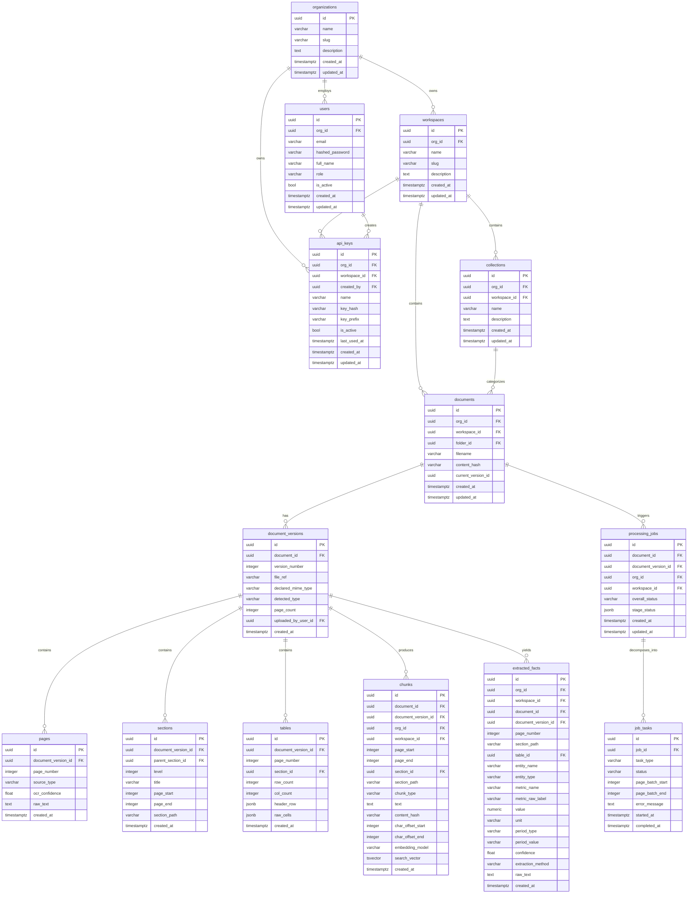

# RAG Pipeline PostgreSQL Entity-Relationship (ER) Diagram

This diagram documents the relational schema and foreign-key constraints implemented in the PostgreSQL database for the RAG Pipeline microservice.

